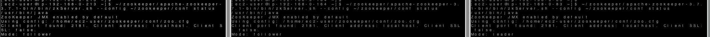

# Kafka on premise

## Install Java

```bash
sudo yum update
sudo yum install java-11-amazon-corretto-headless
java --version
```

# [Zookeeper](https://zookeeper.apache.org/)

## Install Zookeeper

[Zookeeper releases](https://zookeeper.apache.org/releases.html)

```bash
mkdir ~/zookeeper
cd ~/zookeeper

wget https://dlcdn.apache.org/zookeeper/zookeeper-3.7.1/apache-zookeeper-3.7.1-bin.tar.gz
tar -zxvf apache-zookeeper-3.7.1-bin.tar.gz
# ln -s apache-zookeeper-3.7.1-bin zookeeper
```

## Zookeeper configuration

```bash
mkdir ~/zookeeper/data
# server 1
echo 1 > ~/zookeeper/data/myid
# server 2
echo 2 > ~/zookeeper/data/myid
# server 3
echo 3 > ~/zookeeper/data/myid
```

```bash
mkdir ~/zookeeper/conf
cp apache-zookeeper-3.7.1-bin/conf/zoo_sample.cfg ~/zookeeper/conf/zoo.cfg

vim ~/zookeeper/conf/zoo.cfg
```

server 1
```conf
# the directory where the snapshot is stored. 
# do not use /tmp for storage, /tmp here is just  
# example sakes. 
dataDir=/home/ec2-user/zookeeper/data
# the port at which the clients will connect 
clientPort=2181 
server.1=0.0.0.0:2888:3888
server.2=192.168.0.164:2888:3888
server.3=192.168.0.83:2888:3888
```

server 2
```conf
# the directory where the snapshot is stored. 
# do not use /tmp for storage, /tmp here is just  
# example sakes. 
dataDir=/home/ec2-user/zookeeper/data
# the port at which the clients will connect 
clientPort=2181 
server.1=192.168.0.213:2888:3888
server.2=0.0.0.0:2888:3888
server.3=192.168.0.83:2888:3888
```

server 3
```conf
# the directory where the snapshot is stored. 
# do not use /tmp for storage, /tmp here is just  
# example sakes. 
dataDir=/home/ec2-user/zookeeper/data
# the port at which the clients will connect 
clientPort=2181 
server.1=192.168.0.213:2888:3888
server.2=192.168.0.164:2888:3888
server.3=0.0.0.0:2888:3888
```

## Run Zookeeper

```bash
~/zookeeper/apache-zookeeper-3.7.1-bin/bin/zkServer.sh --config ~/zookeeper/conf start

~/zookeeper/apache-zookeeper-3.7.1-bin/bin/zkServer.sh --config ~/zookeeper/conf status
```



## Command ETC

```bash
~/zookeeper/apache-zookeeper-3.7.1-bin/bin/zkServer.sh --config ~/zookeeper/conf stop
```

# [Kafka](https://kafka.apache.org/)

## Install Kafka

[Kafka releases](https://kafka.apache.org/downloads)

```bash
mkdir ~/kafka && cd ~/kafka

wget https://downloads.apache.org/kafka/3.4.0/kafka_2.12-3.4.0.tgz
tar -xvf kafka_2.12-3.4.0.tgz
# ln -s kafka_2.12-3.4.0 kafka
```

## Kafka configuration

[Borker configs](https://kafka.apache.org/documentation/#brokerconfigs)

### Heap memory

레코드의 내용은 페이지 캐시로 시스템 메모리를 사용  
나머지 객체들을 힙 메모리에 저장하여 사용  

일반적으로 힙 메모리를 5G 이상으로 설정하지 않음  

default  
- Zookeeper: 512M
- Kafka: 1G

```bash
echo "
### KAFKA CONFIG
export KAFKA_HEAP_OPTS=\"-Xmx400m -Xms400m\"
" >> ~/.bashrc

source ~/.bashrc
echo $KAFKA_HEAP_OPTS
```

### Cluster

- 내부와 외부에 오픈할 특정 IP를 별도로 두기 위해서 listeners, advertised.listeners 가 존재
  - listeners
    - 카프카 브로커가 내부적으로 바인딩하는 주소
    - 설정하지 않을 경우 모든 ip와 port에서 접속할 수 있다
  - advertised.listeners
    - 카프카 프로듀서, 컨슈머에게 노출할 주소 
    - 설정하지 않을 경우 디폴트로 listeners 설정을 따른다

- SASL_PLAINTEXT,SASL_SSL:SASL_SSL
  - SSL 보안설정시 프로토콜 매핑을 위한 설정

- num.network.threads
  - 네트워크 처리시 사용할 네트워크 스레드 개수 설정
- num.io.threads
  - 브로커 내부에서 사용할 스레드 개수 설정

- log.dirs
  - 통신을 통해 가져온 데이터를 파일로 저장할 디렉토리 위치
  - 디렉토리가 생성되어 있지 않으면 오류가 발생
  - 브로커 실행 전 생성여부 확인할것
 
- num.partitions
  - 파티션 개수를 명시하지 않고 토픽 생성시 기본 설정되는 파티션 개수

- log.retention.hours
  - 브로커가 저장한 파일이 삭제되기까지 걸리는 시간을 설정
  - log.retention.ms 로 ms단위로 설정가능
  - log.retention.ms 값을 -1로 설정하면 파일은 영원히 삭제되지 않음
- log.segment.bytes
  - 브로커가 저장할 파일의 최대 크기를 지정
- log.retention.check.interval.ms
  - 브로커가 저장한 파일을 삭제하기 위해 체크하는 간격을 지정

- zookeeper.connect
  - 브로커와 연동할 주키퍼의 ip, port 설정
  - /kafka-test 와 같이 설정하여 주키퍼 root znode를 사용하지 않고 하위 znode를 사용한다
- zookeeper.connection.timeout.ms
  - 주키퍼의 세션 타임아웃 시간을 설정

```bash
mkdir ~/kafka/kafka-logs
mkdir ~/kafka/config
cp ~/kafka/kafka_2.12-3.4.0/config/server.properties ~/kafka/config/

vim ~/kafka/config/server.properties
```

server 1
```conf
broker.id=1

# 테스트를 위해 public ip로 설정하여 로컬 컴퓨터에서 해당 주소로 붙을 수 있도록 한다.
# 보안을 위해 private ip로 작성
advertised.listeners=PLAINTEXT://192.168.0.213:9092

log.dirs=/home/ec2-user/kafka/kafka-logs

zookeeper.connect=192.168.0.213:2181,192.168.0.164:2181,192.168.0.83:2181/kafka-test
```

server 2
```conf
broker.id=2

# 테스트를 위해 public ip로 설정하여 로컬 컴퓨터에서 해당 주소로 붙을 수 있도록 한다.
# 보안을 위해 private ip로 작성
advertised.listeners=PLAINTEXT://192.168.0.164:9092

log.dirs=/home/ec2-user/kafka/kafka-logs

zookeeper.connect=192.168.0.213:2181,192.168.0.164:2181,192.168.0.83:2181/kafka-test
```

server 3
```conf
broker.id=3

# 테스트를 위해 public ip로 설정하여 로컬 컴퓨터에서 해당 주소로 붙을 수 있도록 한다.
# 보안을 위해 private ip로 작성
advertised.listeners=PLAINTEXT://192.168.0.83:9092

log.dirs=/home/ec2-user/kafka/kafka-logs

zookeeper.connect=192.168.0.213:2181,192.168.0.164:2181,192.168.0.83:2181/kafka-test
```

## Run Kafka

```bash
~/kafka/kafka_2.12-3.4.0/bin/kafka-server-start.sh -daemon ~/kafka/config/server.properties

# 프로세스 id 확인
jps -m \ # main 메서드에 전달된 인자를 확인 
    -v # jvm에 전달된 인자 (힙 메모리 설정, log4j 설정 등)

tail -f ~/kafka/kafka_2.12-3.4.0/logs/server.log

netstat -ntlp | grep 9092
```

## Command ETC

```bash
~/kafka/kafka_2.12-3.4.0/bin/kafka-server-stop.sh
```

