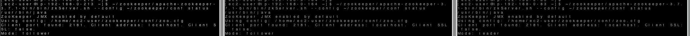

# Kafka on docker

[Kafka cluster mode](./docker/kafka-cluster-docker-compose.yaml)

[Kafka full stack mode](./docker/kafka-full-stack-docker-compose.yaml)

## Reference

[[devson119] Docker Compose를 사용하여 Kafka 셋업하기](https://devs0n.tistory.com/67)

[[conduktor] kafka-stack-docker-compose](https://github.com/conduktor/kafka-stack-docker-compose)

# Kafka on premise

## Install Java

```bash
sudo yum update
sudo yum install java-11-amazon-corretto-headless
java --version
```

---

# [Zookeeper](https://zookeeper.apache.org/)

## Install Zookeeper

[Zookeeper releases](https://zookeeper.apache.org/releases.html)

```bash
mkdir ~/zookeeper
cd ~/zookeeper

wget https://dlcdn.apache.org/zookeeper/zookeeper-3.7.1/apache-zookeeper-3.7.1-bin.tar.gz
tar -zxvf apache-zookeeper-3.7.1-bin.tar.gz
# ln -s apache-zookeeper-3.7.1-bin zookeeper
```

## Zookeeper configuration

```bash
mkdir ~/zookeeper/data
# server 1
echo 1 > ~/zookeeper/data/myid
# server 2
echo 2 > ~/zookeeper/data/myid
# server 3
echo 3 > ~/zookeeper/data/myid
```

```bash
mkdir ~/zookeeper/conf
cp apache-zookeeper-3.7.1-bin/conf/zoo_sample.cfg ~/zookeeper/conf/zoo.cfg

vim ~/zookeeper/conf/zoo.cfg
```

server 1
```conf
# the directory where the snapshot is stored. 
# do not use /tmp for storage, /tmp here is just  
# example sakes. 
dataDir=/home/ec2-user/zookeeper/data
# the port at which the clients will connect 
clientPort=2181 
server.1=0.0.0.0:2888:3888
server.2=192.168.0.164:2888:3888
server.3=192.168.0.83:2888:3888
```

server 2
```conf
# the directory where the snapshot is stored. 
# do not use /tmp for storage, /tmp here is just  
# example sakes. 
dataDir=/home/ec2-user/zookeeper/data
# the port at which the clients will connect 
clientPort=2181 
server.1=192.168.0.213:2888:3888
server.2=0.0.0.0:2888:3888
server.3=192.168.0.83:2888:3888
```

server 3
```conf
# the directory where the snapshot is stored. 
# do not use /tmp for storage, /tmp here is just  
# example sakes. 
dataDir=/home/ec2-user/zookeeper/data
# the port at which the clients will connect 
clientPort=2181 
server.1=192.168.0.213:2888:3888
server.2=192.168.0.164:2888:3888
server.3=0.0.0.0:2888:3888
```

## Run Zookeeper

```bash
~/zookeeper/apache-zookeeper-3.7.1-bin/bin/zkServer.sh --config ~/zookeeper/conf start

~/zookeeper/apache-zookeeper-3.7.1-bin/bin/zkServer.sh --config ~/zookeeper/conf status
```



## Command ETC

```bash
~/zookeeper/apache-zookeeper-3.7.1-bin/bin/zkServer.sh --config ~/zookeeper/conf stop
```

## Kafka metadata in Zookeeper

```bash
~/zookeeper/apache-zookeeper-3.7.1-bin/bin/zkCli.sh
```

카프카와 관련된 메타데이터

```bash
[zk: localhost:2181(CONNECTED) 0] ls /kafka-test
[admin, brokers, cluster, config, consumers, controller, controller_epoch, feature, isr_change_notification, latest_producer_id_block, log_dir_event_notification]
```

브로커 정보 확인
- 통신 보안 규칙
- jmx port 상태
- host 정보 

```bash
[zk: localhost:2181(CONNECTED) 1] get /kafka-test/brokers/ids/1
{"listener_security_protocol_map":{"PLAINTEXT":"PLAINTEXT"},"endpoints":["PLAINTEXT://public.kafka.server.ip:9092"],"jmx_port":-1,"features":{},"host":"public.kafka.server.ip","timestamp":"1676813353851","port":9092,"version":5}
```

브로커중 컨트롤러에 대한 데이터

```bash
[zk: localhost:2181(CONNECTED) 2] get /kafka-test/controller
{"version":2,"brokerid":2,"timestamp":"1676813353461","kraftControllerEpoch":-1}
```

카프카에 저장된 토픽

```bash
[zk: localhost:2181(CONNECTED) 3] ls /kafka-test/brokers/topics
[__consumer_offsets, hello.kafka, hello.kafka2, verify-test]

[zk: localhost:2181(CONNECTED) 4] get /kafka-test/brokers/topics/hello.kafka
{"removing_replicas":{},"partitions":{"2":[2],"1":[1],"0":[3],"3":[3]},"topic_id":"qCqvWVu9Q6OJ_udtfKYegA","adding_replicas":{},"version":3}
```

---

# [Kafka](https://kafka.apache.org/)

## Install Kafka

[Kafka releases](https://kafka.apache.org/downloads)

```bash
mkdir ~/kafka && cd ~/kafka

wget https://downloads.apache.org/kafka/3.4.0/kafka_2.12-3.4.0.tgz
tar -xvf kafka_2.12-3.4.0.tgz
# ln -s kafka_2.12-3.4.0 kafka
```

## Kafka configuration

[Borker configs](https://kafka.apache.org/documentation/#brokerconfigs)

### Heap memory

레코드의 내용은 페이지 캐시로 시스템 메모리를 사용  
나머지 객체들을 힙 메모리에 저장하여 사용  

일반적으로 힙 메모리를 5G 이상으로 설정하지 않음  

default  
- Zookeeper: 512M
- Kafka: 1G

```bash
echo "
### KAFKA CONFIG
export KAFKA_HEAP_OPTS=\"-Xmx400m -Xms400m\"
" >> ~/.bashrc

source ~/.bashrc
echo $KAFKA_HEAP_OPTS
```

### Cluster

- 내부와 외부에 오픈할 특정 IP를 별도로 두기 위해서 listeners, advertised.listeners 가 존재
  - listeners
    - 카프카 브로커가 내부적으로 바인딩하는 주소
    - 설정하지 않을 경우 모든 ip와 port에서 접속할 수 있다
  - advertised.listeners
    - 카프카 프로듀서, 컨슈머에게 노출할 주소 
    - 설정하지 않을 경우 디폴트로 listeners 설정을 따른다

- SASL_PLAINTEXT,SASL_SSL:SASL_SSL
  - SSL 보안설정시 프로토콜 매핑을 위한 설정

- num.network.threads
  - 네트워크 처리시 사용할 네트워크 스레드 개수 설정
- num.io.threads
  - 브로커 내부에서 사용할 스레드 개수 설정

- log.dirs
  - 통신을 통해 가져온 데이터를 파일로 저장할 디렉토리 위치
  - 디렉토리가 생성되어 있지 않으면 오류가 발생
  - 브로커 실행 전 생성여부 확인할것
 
- num.partitions
  - 파티션 개수를 명시하지 않고 토픽 생성시 기본 설정되는 파티션 개수

- log.retention.hours
  - 브로커가 저장한 파일이 삭제되기까지 걸리는 시간을 설정
  - log.retention.ms 로 ms단위로 설정가능
  - log.retention.ms 값을 -1로 설정하면 파일은 영원히 삭제되지 않음
- log.segment.bytes
  - 브로커가 저장할 파일의 최대 크기를 지정
- log.retention.check.interval.ms
  - 브로커가 저장한 파일을 삭제하기 위해 체크하는 간격을 지정

- zookeeper.connect
  - 브로커와 연동할 주키퍼의 ip, port 설정
  - /kafka-test 와 같이 설정하여 주키퍼 root znode를 사용하지 않고 하위 znode를 사용한다
- zookeeper.connection.timeout.ms
  - 주키퍼의 세션 타임아웃 시간을 설정

```bash
mkdir ~/kafka/kafka-logs
mkdir ~/kafka/config
cp ~/kafka/kafka_2.12-3.4.0/config/server.properties ~/kafka/config/

vim ~/kafka/config/server.properties
```

server 1
```conf
broker.id=1

# 테스트를 위해 public ip로 설정하여 로컬 컴퓨터에서 해당 주소로 붙을 수 있도록 한다.
# 보안을 위해 private ip로 작성
advertised.listeners=PLAINTEXT://192.168.0.213:9092

log.dirs=/home/ec2-user/kafka/kafka-logs

zookeeper.connect=192.168.0.213:2181,192.168.0.164:2181,192.168.0.83:2181/kafka-test
```

server 2
```conf
broker.id=2

# 테스트를 위해 public ip로 설정하여 로컬 컴퓨터에서 해당 주소로 붙을 수 있도록 한다.
# 보안을 위해 private ip로 작성
advertised.listeners=PLAINTEXT://192.168.0.164:9092

log.dirs=/home/ec2-user/kafka/kafka-logs

zookeeper.connect=192.168.0.213:2181,192.168.0.164:2181,192.168.0.83:2181/kafka-test
```

server 3
```conf
broker.id=3

# 테스트를 위해 public ip로 설정하여 로컬 컴퓨터에서 해당 주소로 붙을 수 있도록 한다.
# 보안을 위해 private ip로 작성
advertised.listeners=PLAINTEXT://192.168.0.83:9092

log.dirs=/home/ec2-user/kafka/kafka-logs

zookeeper.connect=192.168.0.213:2181,192.168.0.164:2181,192.168.0.83:2181/kafka-test
```

## Run Kafka

```bash
~/kafka/kafka_2.12-3.4.0/bin/kafka-server-start.sh -daemon ~/kafka/config/server.properties

# 프로세스 id 확인
jps -m \ # main 메서드에 전달된 인자를 확인 
    -v # jvm에 전달된 인자 (힙 메모리 설정, log4j 설정 등)

tail -f ~/kafka/kafka_2.12-3.4.0/logs/server.log

netstat -ntlp | grep 9092
```

## Command ETC

```bash
~/kafka/kafka_2.12-3.4.0/bin/kafka-server-stop.sh
```

## Connection test

hosts 설정
```bash
sudo vim /etc/hosts

public.ip.kafka.01 kafka1
public.ip.kafka.02 kafka2
public.ip.kafka.03 kafka3
```

```bash
~/kafka/kafka_2.12-3.4.0/bin/kafka-broker-api-versions.sh --bootstrap-server kafka1:9092,kafka2:9092,kafka3:9092
```

## Kafka log dir

브로커에 저장된 파일 시스템  
- config/server.propertie에 log.dir 옵션 설정 디렉토리  
- 토픽 이름과 파티션 번호의 조합으로 하위 디렉토리를 생성하여 데이터를 저장  

```text
Topic: hello.kafka	TopicId: qCqvWVu9Q6OJ_udtfKYegA	PartitionCount: 4	ReplicationFactor: 1	Configs: retention.ms=86400000
	Topic: hello.kafka	Partition: 0	Leader: 3	Replicas: 3	Isr: 3
	Topic: hello.kafka	Partition: 1	Leader: 1	Replicas: 1	Isr: 1
	Topic: hello.kafka	Partition: 2	Leader: 2	Replicas: 2	Isr: 2
	Topic: hello.kafka	Partition: 3	Leader: 3	Replicas: 3	Isr: 3
```

```bash
[ec2-user@ip-192-168-0-213 kafka-logs]$ ls ~/kafka/kafka-logs/
__consumer_offsets-11  __consumer_offsets-44
__consumer_offsets-14  __consumer_offsets-47
__consumer_offsets-17  __consumer_offsets-5
__consumer_offsets-2   __consumer_offsets-8
__consumer_offsets-20  cleaner-offset-checkpoint
__consumer_offsets-23  hello.kafka-1
__consumer_offsets-26  hello.kafka2-1
__consumer_offsets-29  log-start-offset-checkpoint
__consumer_offsets-32  meta.properties
__consumer_offsets-35  recovery-point-offset-checkpoint
__consumer_offsets-38  replication-offset-checkpoint
__consumer_offsets-41
[ec2-user@ip-192-168-0-164 kafka-logs]$ ls ~/kafka/kafka-logs/
__consumer_offsets-0   __consumer_offsets-45
__consumer_offsets-12  __consumer_offsets-48
__consumer_offsets-15  __consumer_offsets-6
__consumer_offsets-18  __consumer_offsets-9
__consumer_offsets-21  cleaner-offset-checkpoint
__consumer_offsets-24  hello.kafka-2
__consumer_offsets-27  hello.kafka2-2
__consumer_offsets-3   log-start-offset-checkpoint
__consumer_offsets-30  meta.properties
__consumer_offsets-33  recovery-point-offset-checkpoint
__consumer_offsets-36  replication-offset-checkpoint
__consumer_offsets-39  verify-test-0
__consumer_offsets-42
[ec2-user@ip-192-168-0-83 kafka-logs]$ ls ~/kafka/kafka-logs/
__consumer_offsets-1   __consumer_offsets-43
__consumer_offsets-10  __consumer_offsets-46
__consumer_offsets-13  __consumer_offsets-49
__consumer_offsets-16  __consumer_offsets-7
__consumer_offsets-19  cleaner-offset-checkpoint
__consumer_offsets-22  hello.kafka-0
__consumer_offsets-25  hello.kafka-3
__consumer_offsets-28  hello.kafka2-0
__consumer_offsets-31  log-start-offset-checkpoint
__consumer_offsets-34  meta.properties
__consumer_offsets-37  recovery-point-offset-checkpoint
__consumer_offsets-4   replication-offset-checkpoint
__consumer_offsets-40
```

hello.kafka 토픽의 1번 파티션에 존재하는 데이터 확인
- 메세지와 메타데이터를 저장
- index: 메세지의 오프셋을 인덱싱한 정보를 담은 파일
- timeindex: 메세지에 포함된 timestamp값을 기준으로 인덱싱한 정보
  - 메세지에는 timestamp 값이 포함된다
  - timestamp 값은 브로커가 적재한 데이터를 삭제하거나 압축하는데 사용

```bash
[ec2-user@ip-192-168-0-213 hello.kafka-1]$ ls ~/kafka/kafka-logs/hello.kafka-1/
00000000000000000000.index  00000000000000000000.log  00000000000000000000.timeindex  leader-epoch-checkpoint  partition.metadata
```

## Configuring min.insync.replicas at Kafka broker level
[Reference](https://www.conduktor.io/kafka/kafka-topic-configuration-min-insync-replicas/#Configuring-min.insync.replicas-at-Kafka-broker-level-3)

브로커 서버 설정 변경
- default value: 1
- open broker configuration file `config/server.properties`
- append config following at the end of the file

```properties
min.insync.replicas=2
```

kafka-configs CLI 를 통한 설정 변경
```bash
# add config
kafka-configs.sh \
--bootstrap-server kafka1:9092 \
--alter \
--entity-type brokers \
--entity-default \
--add-config min.insync.replicas=2

# delete config
kafka-configs.sh \
--bootstrap-server kafka1:9092 \
--alter \
--entity-type brokers \
--entity-default \
--delete-config min.insync.replicas
```
